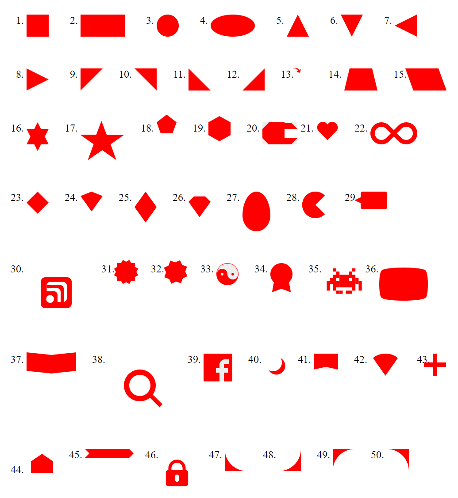

# T305-CSS_Tricks
## -------INFO

1. Layout strony
   1. Floats
   1. Flex
   1. Grid
   2. Position
1. Jednostki w CSS

ABSOLUTE

unit|name
----|------------
cm | centimeters
mm | millimeters
in | inches (1in = 96px = 2.54cm)
px | pixels (1px = 1/96th of 1in)
pt | points (1pt = 1/72 of 1in)
pc | picas (1pc = 12 pt)

RELATIVE

unit|name
----|------------
em | Relative to the font-size of the element (2em means 2 times the size of the current font)	
ex	| Relative to the x-height of the current font (rarely used)	
ch	| Relative to the width of the "0" (zero)	
rem | Relative to font-size of the root element	
vw	| Relative to 1% of the width of the viewport*	
vh	| Relative to 1% of the height of the viewport*	
vmin | Relative to 1% of viewport's* smaller dimension	
vmax | Relative to 1% of viewport's* larger dimension	
% | Relative to the parent element

7. Pseudoklasy (link, visited, hover, active)
```css
p {
  display: none;
  background-color: yellow;
  padding: 20px;
}

div:hover p {
  display: block;
}
```
9. Pseudoelementy [MDN](https://developer.mozilla.org/en-US/docs/Web/CSS/Pseudo-elements)
* ::before,
* ::after,
* ::first-letter (:first-letter)
* ::first-line (:first-line)
11. iFrame
```html
<iframe src="//DuckDuckGo.com" height="200">
    Twoja przeglądarka nie obsługuje iframe.
</iframe>
```

12. Position 
```css
position:<absolute/relative/fixed/sticky>

....
			left:calc(50% - 50px);
			top:calc(50% - 50px);
....


         left:50%;
         top:50%;
         transform:translate(-50%, -50%);
 ```

```
ZADT30501
Przygotować stronę zawierającą krótki opis znaczników h1, p, ul, li z wyjaśnieniem i przykładem użycia.
oraz przykładem uzycia (zastosować encje HTML). Prosty tutorial HTML w autorskim layoucie.

ZADT30502
Odtworzyć layout z poniższej ilustracji (3cols.png)
```

```
ZADT30503
Przygotować stronę wyposażoną w mechanizm "tooltips" z kolorowym tłem i strzałką, reagujące na elementy.

ZADT30504
Przedstaw przy pomocy CSS poniższe kształty i umieść w liście uporządkowanej (50 sztuk).
```



### --------Links
https://github.com/T3iL/T303-CSS

GOOGLE DRIVE: https://drive.google.com/drive/folders/1OqTcjwr_qAdTPO-dThxUOd3ooTTOlzgp?usp=sharing

https://cdnjs.cloudflare.com/ajax/libs/font-awesome/4.7.0/css/font-awesome.min.css

https://www.w3.org | https://validator.w3.org | https://www.php.net/manual/en/

https://css-tricks.com/the-shapes-of-css/

[Flexbox design patterns you can use in your projects](https://www.youtube.com/watch?v=vQAvjof1oe4)

https://htmlcheatsheet.com/css/

### --------Repositiories
https://www.w3schools.com | https://stackoverflow.com | https://css-tricks.com |
### --------On line editors
https://codepen.io/ | https://codesandbox.io/ | https://jsfiddle.net/ |
### ---------Assets
https://cdnjs.com/ | https://fontawesome.com | http://fontello.com/ | https://fonts.google.com/ | https://www.flaticon.com/
### ---------Stock Img
https://www.pexels.com/ | https://unsplash.com | https://pixabay.com
### ---------Tuts
https://www.youtube.com/watch?v=1Rs2ND1ryYc
https://www.youtube.com/watch?v=J35jug1uHzE
https://www.youtube.com/watch?v=ieTHC78giGQ
### ---------License
[MIT](https://choosealicense.com/licenses/mit/)
